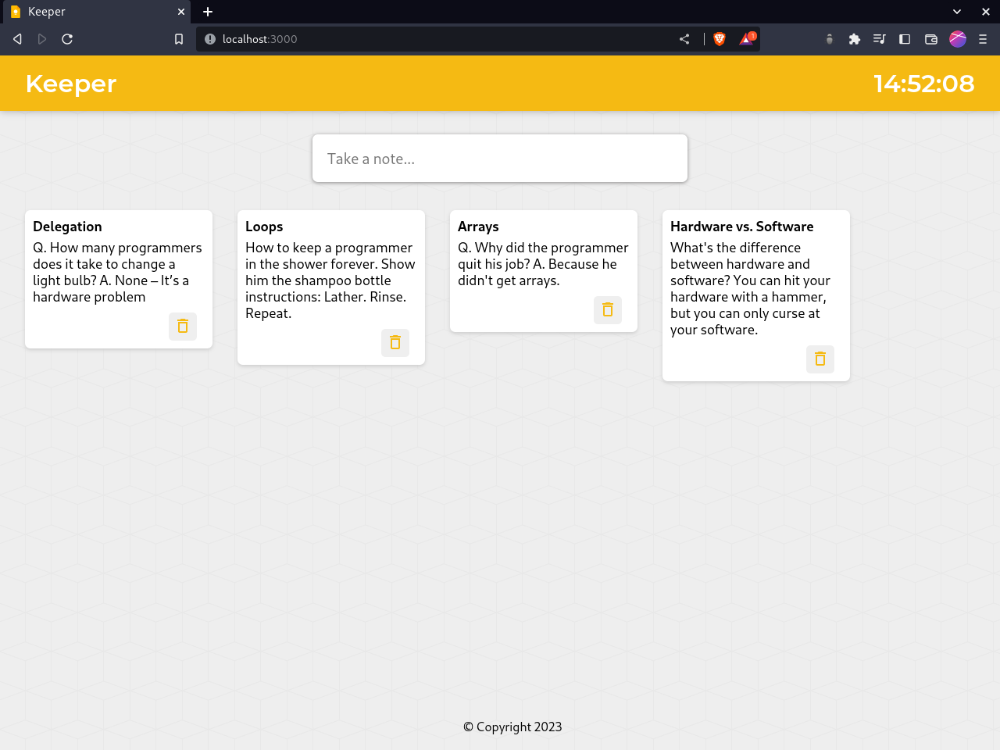

# Note Taking App
A simple note taking application built with React.js

## Features
- Create and save notes with a title and content
- Delete notes by clicking on the delete button
- Show current time on the app

## Requirements
- Node.js
- npm

  

## How to use
1. Clone or download the repository.
2. Run `npm install` to install the required dependencies.
3. Run `npm start` to start the app.
4. The app will be running on http://localhost:3000/ in your browser.

## Technologies used
- React.js
- Material UI

## Components
The app has three main components:

- App.js: The main component that handles the state for the entire app and passes the props to other components.
- Note.js: A component for each note that takes in props and displays the note heading and body. It also has a delete button that calls a function from App.js to delete the note.
- CreateArea.js: A component that displays the form for creating a new note. It contains inputs for the note title and body and a submit button to call a function from App.js to add the new note to the state.
- Time.js: A component that displays the current time. It uses the `setInterval()` function to update the time every second.

## Data
The app has an initial set of data stored in Data.js as an array of objects. Each object has a `title` and `content` property.

